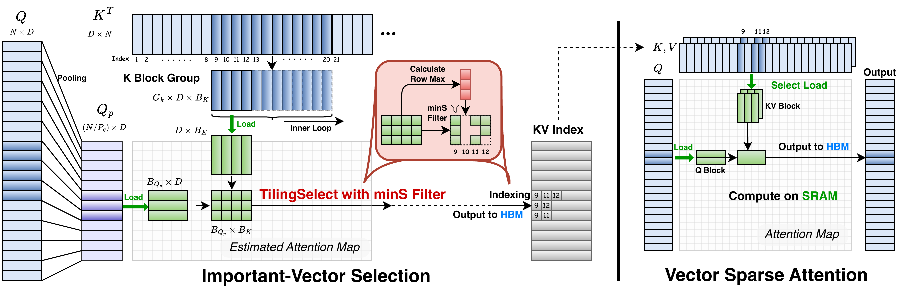
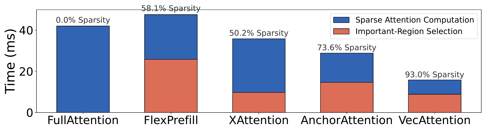
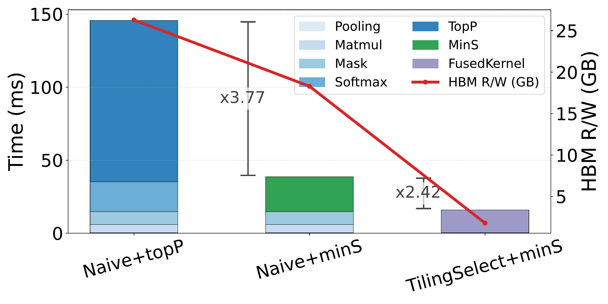

# VecAttention: Vector-wise Sparse Attention for Accelerating Long Context Inference

[](https://arxiv.org/abs/2603.29494)

## Showcase
<table>
  <thead>
    <tr>
      <th></th>
      <th align="center">Full Attention</th>
      <th align="center">VecAttention</th>
    </tr>
  </thead>
  <tbody>
    <tr>
      <th align="center" scope="row">
        Video Understanding
      </th>
      <td align="center">
        <video src="https://github.com/user-attachments/assets/01baf105-6f33-4500-8e14-dee4371b8c72" controls width="360"></video>
      </td>
      <td align="center">
        <video src="https://github.com/user-attachments/assets/748690b6-4734-452d-ac51-64ba00659c7b" controls width="360"></video>
      </td>
    </tr>
    <tr>
      <th align="center" scope="row">
        Video Generation
      </th>
      <td align="center">
        <video src="https://github.com/user-attachments/assets/5970eece-ff57-472a-aaac-4c7570dec9a2" controls width="360"></video>
      </td>
      <td align="center">
        <video src="https://github.com/user-attachments/assets/7b827449-00d8-4406-943f-3f658687db3d" controls width="360"></video>
      </td>
    </tr>
  </tbody>
</table>


## Abstract

Long-context video understanding and generation pose a significant computational challenge for Transformer-based video models due to the quadratic complexity of self-attention. While existing sparse attention methods employ coarse-grained patterns to improve efficiency, they typically incur redundant computation and suboptimal performance. To address this issue, in this paper, we propose **VecAttention**, a novel framework of vector-wise sparse attention that achieves superior accuracy-efficiency trade-offs for video models. We observe that video attention maps exhibit a strong vertical-vector sparse pattern, and further demonstrate that this vertical-vector pattern offers consistently better accuracy-sparsity trade-offs compared with existing coarse-grained sparse patterns. Based on this observation, VecAttention dynamically selects and processes only informative vertical vectors through a lightweight important-vector selection that minimizes memory access overhead and an optimized kernel of vector sparse attention. Comprehensive evaluations on video understanding (VideoMME, LongVideoBench, and VCRBench) and generation (VBench) tasks show that VecAttention delivers a 2.65x speedup over full attention and a 1.83x speedup over state-of-the-art sparse attention methods, with comparable accuracy to full attention.







---

## Installation

### Prerequisites

- Linux with CUDA-capable NVIDIA GPU
- [Docker](https://docs.docker.com/get-docker/) (for containerized setup)
- [uv](https://github.com/astral-sh/uv) — Python package manager
- Git >= 2.13 (for submodule support)

### 0. Clone the repository

VecAttention uses git submodules for `vllm-flash-attention` and the DiTEvalKit third-party kernels. Always clone with `--recurse-submodules`:

```bash
git clone --recurse-submodules https://github.com/anminliu/VecAttention.git
cd VecAttention
```

If you already cloned without submodules, initialize them afterwards:

```bash
git submodule update --init --recursive
```

### 1. Build and start the Docker container (on the host)

```bash
make setup-host
# Optional: pass an HTTP proxy
make setup-host PROXY=http://your-proxy:port
```

This builds a Docker image tagged `vecattention` and starts a container named `vecattention` with full GPU access. The parent directory of the repo is mounted at `/workspace` so the repo appears at `/workspace/VecAttention` inside the container. Override defaults with `DOCKER_IMAGE`, `DOCKER_CONTAINER`, or `HOST_WORKSPACE`.

### 2. Set up the base Python environment (inside the container)

```bash
make setup-container
```

This creates a `uv` virtual environment (`.venv/`) and installs the core Python stack:


| Package    | Version           |
| ---------- | ----------------- |
| Python     | 3.10              |
| PyTorch    | 2.7.0 (CUDA 12.8) |
| Triton     | git `6e390f3f`    |
| FlashInfer | 0.3.1.post1       |


### 3. Build the custom vLLM Flash Attention backend

VecAttention's sparse attention kernel requires our [vllm-flash-attention](https://github.com/anminliu/vllm-flash-attention) submodule (a modified version of [vllm-project/flash-attention](https://github.com/vllm-project/flash-attention)). Make sure submodules were initialized recursively (see step 0), then build it once:

```bash
make fainstall
# If you need a clean rebuild:
make faclean && make fainstall
```

### 4. Environment for evaluation

```bash
# VLM Evaluation (Video-MME, LongVideoBench, VCRBench)
make vlminit
# DiT Evaluation (HunyuanVideo, Wan)
make ditinit
```

> **Note:** `vlm` and `dit` groups conflict and cannot be installed simultaneously. Use `make vlminit` **or** `make ditinit`, not both.

> **If your `nvcc` is older than CUDA 12.8**, export `BLOCK_SPARSE_ATTN_CUDA_ARCHS` to your GPU compute capability before running `make vlminit`/`ditinit` (e.g. `export BLOCK_SPARSE_ATTN_CUDA_ARCHS=80` for A100, `89` for RTX 4090/L40, `90` for H100).

> **Model weights:** All scripts default to looking for model weights under `/workspace/models/` (the standard Docker mount point). Override globally by setting the `MODEL_DIR` environment variable, e.g. `export MODEL_DIR=/path/to/your/models`. Individual scripts also accept `--model` or `--model_id` arguments. Similarly, `DATASET_DIR` controls the dataset root (default: `/workspace/datasets/`).

---

## Quick Use

```python
import torch
from spattn.src.VecAttention import VecAttention_prefill

bsz, heads, seq_len, dim = 1, 32, 32768, 128
q = torch.randn(bsz, heads, seq_len, dim, dtype=torch.bfloat16, device="cuda")
k = torch.randn(bsz, heads, seq_len, dim, dtype=torch.bfloat16, device="cuda")
v = torch.randn(bsz, heads, seq_len, dim, dtype=torch.bfloat16, device="cuda")

out = VecAttention_prefill(
    q, k, v,
    threshold=0.9,        # MinP gap threshold (higher -> more sparse)
    q_pooling_size=64,    # Q block pooling size (Pq)
    k_local_size=16,      # K local block size (Bk)
    group_k_block=16,     # K-tile group size (Gk)
    causal=True,
    chunk_size=64 * 1024,
)
```

---

## Demo

The `demo/` directory contains three scripts for quickly trying VecAttention:

### Vision NIAH demo

Loads a Qwen2.5-VL model, patches its attention layers with VecAttention, and runs a vision needle-in-a-haystack task to verify both correctness and speedup. Requires a long haystack video (≥1h recommended) on disk — pass its path via `--haystack_movie_path`.

```bash
source .venv/bin/activate

# Run with VecAttention
python demo/vision_demo.py --haystack_movie_path /path/to/movie.mp4 --nframe 180 --metric vecattention  --threshold 0.87

# Run with full attention (baseline comparison)
python demo/vision_demo.py --haystack_movie_path /path/to/movie.mp4 --nframe 180 --metric full
```

### VLM evaluation demo

Quick pipeline check for video understanding evaluation (requires `make vlminit`):

```bash
bash demo/run_vlm_bench_demo.sh [GPU_IDS] [THRESHOLD] [NUM_SAMPLES]
# Example:
bash demo/run_vlm_bench_demo.sh 0 0.8 4
```

### DiT evaluation demo

Quick pipeline check for video generation evaluation (requires `make ditinit`):

```bash
bash demo/run_dit_bench_demo.sh [GPU_IDS] [BACKEND] [INFER_STEP]
# Example:
bash demo/run_dit_bench_demo.sh 0 wan 2
```

---

## Evaluation

On VideoMME at matched full-accuracy settings, VecAttention attains higher effective sparsity and faster attention computation, with low important-region selection overhead, compared to existing coarse-grained methods.


### Video Understanding — VLMEvalKit

**Setup:** `make vlminit`

**Supported models:** Qwen2.5-VL-7B (`qwenvl`), InternVL-3.5-8B (`internvl`)

**Supported benchmarks:** VideoMME, LongVideoBench, VCRBench

> **Note:** VLM evaluation uses a uniform threshold across all heads and does **not** require per-head dynamic programming (DP) threshold tuning. Simply pass a threshold value directly.

**Single threshold run:**

```bash
cd eval/VLMEvalKit

# VecAttention on all benchmarks with Qwen2.5-VL
bash run_single_th.sh vecattention 0 all results qwenvl 0.8

# Full attention baseline
bash run_single_th.sh full 0 all results qwenvl
```

**Multi-threshold sweep** (for Pareto curve):

```bash
cd eval/VLMEvalKit
bash run_multi_th.sh vecattention 0,1,2,3 all results qwenvl
```

#### Results

Performance on video understanding tasks (all values are percentages):

**InternVL-3.5-8B** (64 frames, ~17K tokens)


| Method           | Avg. Sparsity | VideoMME | LongVideoBench | VCRBench | Avg. Acc. |
| ---------------- | ------------- | -------- | -------------- | -------- | --------- |
| Full Attention   | 0.0           | 65.7     | 59.4           | 32.9     | 52.7      |
| FlexPrefill      | 76.5          | 52.3     | 59.0           | 30.0     | 47.1      |
| XAttention       | 78.1          | 56.0     | **59.9**       | 32.5     | 49.5      |
| AnchorAttention  | 78.6          | 57.4     | 59.4           | 31.3     | 49.4      |
| **VecAttention** | **78.6**      | **60.6** | 59.0           | **33.8** | **51.1**  |


**Qwen2.5-VL-7B-Instruct** (1 FPS, ~26K tokens)


| Method           | Avg. Sparsity | VideoMME | LongVideoBench | VCRBench | Avg. Acc. |
| ---------------- | ------------- | -------- | -------------- | -------- | --------- |
| Full Attention   | 0.0           | 63.9     | 59.9           | 25.8     | 49.9      |
| FlexPrefill      | 73.6          | 62.0     | 56.7           | 22.5     | 47.1      |
| XAttention       | 73.6          | 63.0     | 58.5           | 20.0     | 47.2      |
| AnchorAttention  | 74.6          | 64.4     | **60.8**       | 22.9     | 49.4      |
| **VecAttention** | **78.5**      | **64.8** | 59.4           | **25.4** | **49.9**  |


### Video Generation — DiTEvalKit

**Setup:** `make ditinit`

**Supported backends:** HunyuanVideo-T2V-13B (`hyvideo`), Wan2.1-T2V-14B (`wan`)

DiT evaluation supports two modes for VecAttention: a **uniform threshold** (`vecattention_wo_DP`) that requires no setup, and **per-head DP-tuned thresholds** (`vecattention`) that yield better accuracy-sparsity trade-offs. The paper results use DP-tuned thresholds.

**Without DP**:

```bash
# VecAttention with uniform threshold on Wan
bash eval/DiTEvalKit/run_single_th.sh 0 vecattention_wo_DP wan 0.001

# Dense baseline
bash eval/DiTEvalKit/run_single_th.sh 0 dense wan

# XAttention baseline
bash eval/DiTEvalKit/run_single_th.sh 0 xattn hyvideo 0.9
```

**With DP** (per-head threshold tuning):

To reproduce the paper's DiT results, you need to run DP threshold tuning for each model. The process has three steps:

*Step 1 — Dump QK matrices* from a few reference prompts:

```bash
# For hyvideo (use --backend wan --dump-step 25 for Wan)
bash spattn/threshold/dump_qk_layers.sh \
    --backend hyvideo --dump-step 5 --gpus 0,1,2 --prompt-ids 0,1,2
```

This saves QK activations to `spattn/threshold/QK_Cache/<Model>/`.

*Step 2 — Tune per-head thresholds* via dynamic programming:

```bash
bash spattn/threshold/tune_cmd.sh 0,1,2 --model HunyuanVideo
# For Wan:
# bash spattn/threshold/tune_cmd.sh 0,1,2 --model Wan
```

> `tune_cmd.sh` defaults to `--prompt_to_list 0 1 2`. If you dumped a different set of prompts in Step 1, override it via `--extra-common-args "--prompt_to_list <ids>"` (e.g. `--extra-common-args "--prompt_to_list 0"` when you only dumped prompt 0).

This produces per-head threshold files under `spattn/threshold/tune_cache/<Model>/`. You can optionally clean up the QK cache after tuning to free disk space:

```bash
rm -rf spattn/threshold/QK_Cache/<Model>/
```

*Step 3 — Run evaluation with DP thresholds:*

```bash
# The 'vecattention' method (without _wo_DP) automatically loads threshold files
# The 4th argument is the target sparsity (matches threshold filename)
bash eval/DiTEvalKit/run_single_th.sh 0 vecattention wan 0.550
```

> **If you want classifier-free guidance (CFG):** CFG runs separate positive and negative attention passes, each needing its own threshold file. Run **Step 1** twice — once with `--dump-subdir positive` and once with `--dump-subdir negative` — then repeat **Step 2** twice with the matching `--subdir`. The `vecattention` method will auto-load both at evaluation time. To skip CFG and reuse a single threshold for both passes, set `GUIDANCE_SCALE=0` when invoking the eval scripts.

**Multi-threshold Pareto sweep:**

```bash
bash eval/DiTEvalKit/run_multi_th.sh 0,1 "vecattention,dense,xattn,svg" "hyvideo,wan"
```

**Calculate metrics** (after inference completes):

Single-directory mode — compare one sparse-attention output directory against a dense reference:

```bash
python eval/DiTEvalKit/calc_metrics.py \
    --ref_dir path/to/dense \
    --out_dir path/to/vecattention
```

Simple batch mode — auto-discover and evaluate every output directory under a method, using the dense run as the reference:

```bash
python eval/DiTEvalKit/calc_metrics.py --method vecattention
```

#### Results

Performance on video generation tasks (50 inference steps, 6% warm-up ratio):

**Wan 2.1-T2V-14B** (720P, ~76K tokens)


| Method           | Sparsity(%) | PSNR     | SSIM      | LPIPS     |
| ---------------- | ----------- | -------- | --------- | --------- |
| XAttention       | 54.6        | 19.7     | 0.658     | 0.348     |
| SVG              | 52.2        | 18.7     | 0.639     | 0.381     |
| **VecAttention** | 52.3        | **19.7** | **0.668** | **0.339** |


**HunyuanVideo-T2V-13B** (720P, ~119K tokens)


| Method           | Sparsity(%) | PSNR     | SSIM      | LPIPS     |
| ---------------- | ----------- | -------- | --------- | --------- |
| XAttention       | 60.8        | 21.2     | 0.734     | 0.348     |
| SVG              | 60.1        | 21.8     | 0.769     | **0.326** |
| **VecAttention** | **62.1**    | **22.8** | **0.779** | 0.330     |


---

## Efficiency

**Attention layer latency benchmark** (requires Qwen2.5-VL-7B-Instruct weights):

```bash
source .venv/bin/activate
python spattn/benchmarks/bench_attn_layer.py
```

Compares full attention vs VecAttention (and optionally XAttention, FlexPrefill, AnchorAttention) across sequence lengths [8K, 16K, 32K, 64K, 128K]. Edit the `methods_to_compare` list in `__main__` to enable additional methods.

**Kernel autotuning:** We ship pretuned Triton kernel configs under `spattn/src/kernels/cache/` (for both `vlm` and `dit` environments). To retune on your own GPU for potentially better performance, run:

```bash
python spattn/src/kernels/vecattention_kernels.py
```

---

## Citation

```bibtex
@inproceedings{vecattention2026,
  title     = {{VecAttention}: Vector-wise Sparse Attention for Accelerating Long Context Inference},
  author    = {Anmin Liu and Ruixuan Yang and Huiqiang Jiang and Bin Lin and Minmin Sun and Yong Li and Chen Zhang and Tao Xie},
  booktitle = {Proceedings of the IEEE/CVF Conference on Computer Vision and Pattern Recognition (CVPR)},
  year      = {2026}
}
```

## Acknowledgements

Thanks to:

- [XAttention](https://github.com/mit-han-lab/x-attention) — block sparse attention baseline and codebase structure reference
- [FlexPrefill](https://github.com/bytedance/FlexPrefill) — flexible prefill baseline
- [FlashInfer](https://github.com/flashinfer-ai/flashinfer) — provides high-performance kernels
- [VLMEvalKit](https://github.com/open-compass/VLMEvalKit) — video understanding evaluation
- [Sparse-VideoGen](https://github.com/svg-project/Sparse-VideoGen) — sparse video generation baseline
- [FlashAttention](https://github.com/vllm-project/flash-attention) — upstream that `vllm-flash-attention/` is modified from

